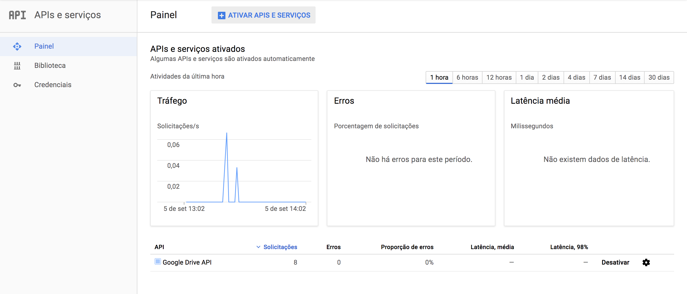
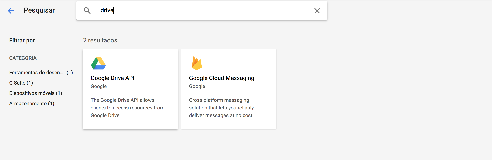
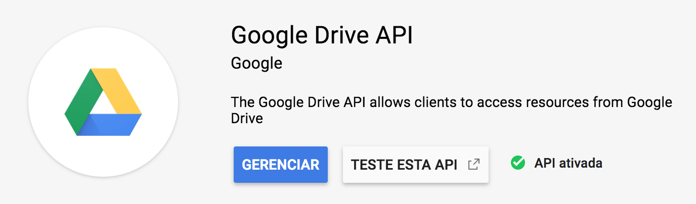
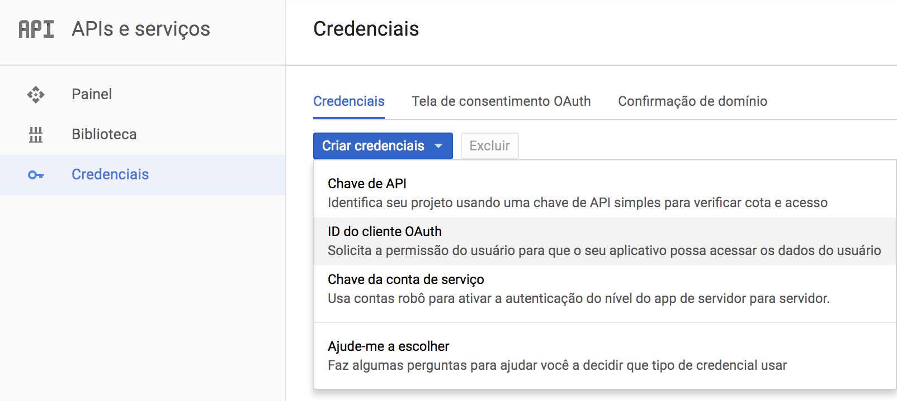
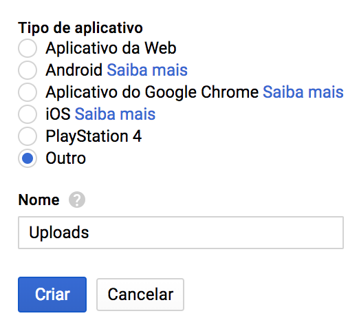
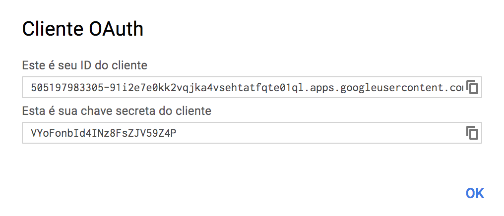

# google-access-token

Utilitary for generating access/refresh tokens.

## Installation

```bash
$ go get -u github.com/tpisani/google-access-token
```

## Usage

```bash
$ google-access-token <client_id> <client_secret>
```

## Walkthrough

Access the [Google Developers Console](https://console.developers.google.com/).


Make sure Google Drive API is active.



Create a new OAuth client.



Copy client ID and secret.


Run `google-access-token` with these credentials.
```bash
$ google-access-token <client_id> <client_secret>
```
